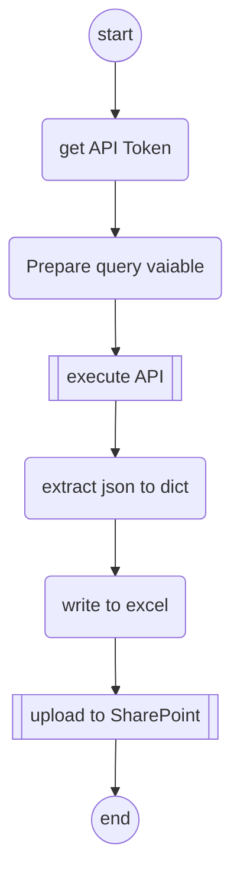

# python-workplace
for testing and develop with Python

```mermaid
flowchart TD;
    a((start))-->b(get API Token)
    b-->c(Prepare query vaiable)
    c-->d[[execute API]]
    d-->e(extract json to dict)
    e-->f(write to excel)
    f-->g[[upload to SharePoint]]
    g-->h((end))
```